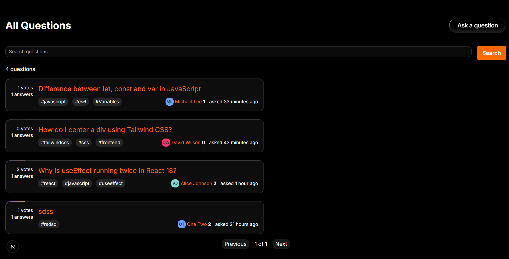
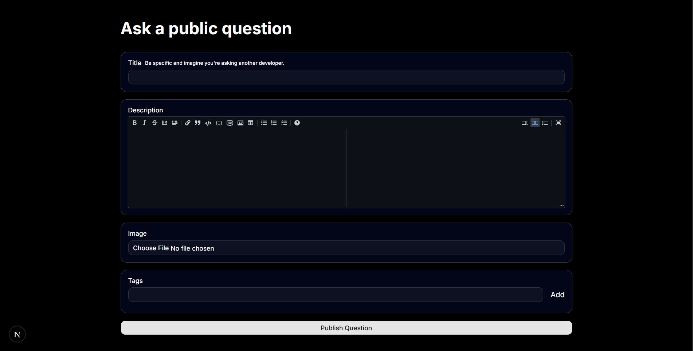
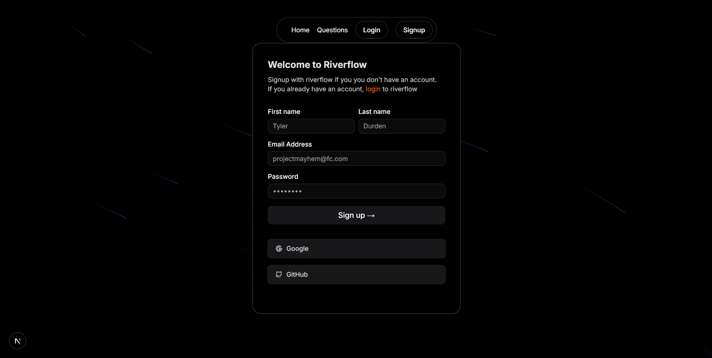
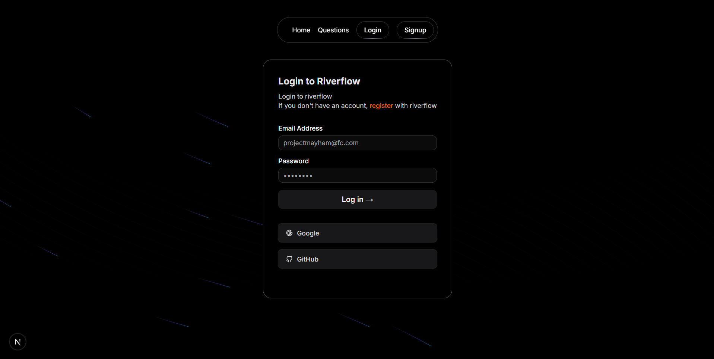

# 🌊 Riverflow

> A modern developer Q&A platform inspired by Stack Overflow, built with Next.js, TypeScript, Tailwind CSS, and Appwrite.


---

## 📖 About

Riverflow is a full-stack developer community platform where developers can ask programming questions, post answers, share knowledge, and interact through voting and comments.

It provides a modern, responsive experience with secure authentication, markdown support, image attachments, and real-time community interactions.

---

## ✨ Features

### 👤 Authentication

- Secure user authentication with Appwrite
- Login & Signup
- Protected routes
- User profiles

### ❓ Questions

- Ask programming questions
- Rich Markdown editor
- Upload image attachments
- Add tags
- Edit/Delete your questions

### 💬 Answers

- Post answers
- Rich Markdown support
- Community discussions

### 👍 Voting System

- Upvote questions
- Downvote questions
- Upvote answers
- Downvote answers

### 💭 Comments

- Comment on questions
- Comment on answers

### 🔍 Search

- Search questions
- Browse latest discussions

### 🎨 Modern UI

- Fully responsive
- Dark theme
- Clean developer-friendly interface

---

# 🛠 Tech Stack

| Technology | Usage |
|------------|-------|
| Next.js 16 | Full Stack Framework |
| React 19 | UI Development |
| TypeScript | Type Safety |
| Tailwind CSS | Styling |
| Appwrite | Authentication, Database & Storage |
| React Hook Form | Forms |
| Zod | Validation |
| React Markdown | Markdown Rendering |
| Lucide Icons | Icons |

---

# 📂 Project Structure

```
src/
│
├── app/
├── components/
├── constants/
├── hooks/
├── lib/
├── models/
├── providers/
├── styles/
├── types/
└── utils/
```

---

# 🚀 Getting Started

## Clone Repository

```bash
git clone https://github.com/your-username/riverflow.git

cd riverflow
```

## Install Dependencies

```bash
npm install
```

## Configure Environment Variables

Create a `.env.local` file.

```env
NEXT_PUBLIC_APPWRITE_HOST_URL=
NEXT_PUBLIC_APPWRITE_PROJECT_ID=
APPWRITE_API_KEY=

```

---

## Run Development Server

```bash
npm run dev
```

Visit

```
http://localhost:3000
```

---

# 📸 Screenshots

## Home Page

.png)
.png)

---

## Question Details



---

## Ask Question



---

## Register

---

## Login



---

## Profile

.png)
.png)
.png)
.png)

---

# 🎥 Demo

Will be available soon

---

# 🔥 Future Improvements

- Notification System
- Reputation Points
- Accepted Answers
- Bookmarks
- Rich User Profiles
- Badges & Achievements
- Infinite Scrolling
- AI-powered Question Suggestions

---

# 🤝 Contributing

Contributions are welcome!

1. Fork the repository
2. Create a feature branch

```bash
git checkout -b feature-name
```

3. Commit your changes

```bash
git commit -m "Added new feature"
```

4. Push

```bash
git push origin feature-name
```

5. Open a Pull Request

---

# 👨‍💻 Author

**Aakash Pathrikar**

- GitHub: https://github.com/Gysum
- LinkedIn: https://linkedin.com/in/aakash-pathrikar

---

# ⭐ Show Your Support

If you like this project, consider giving it a ⭐ on GitHub!

It motivates me to build more open-source projects.

